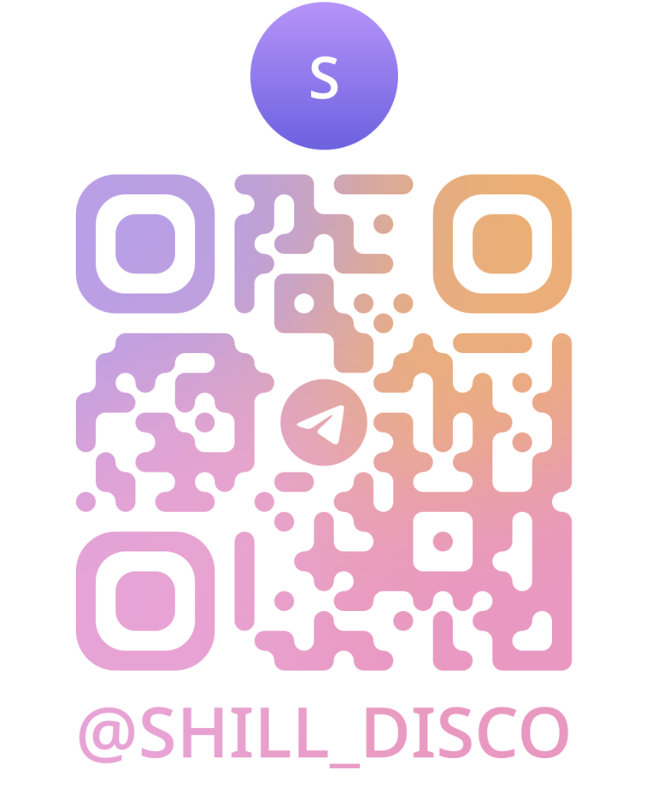
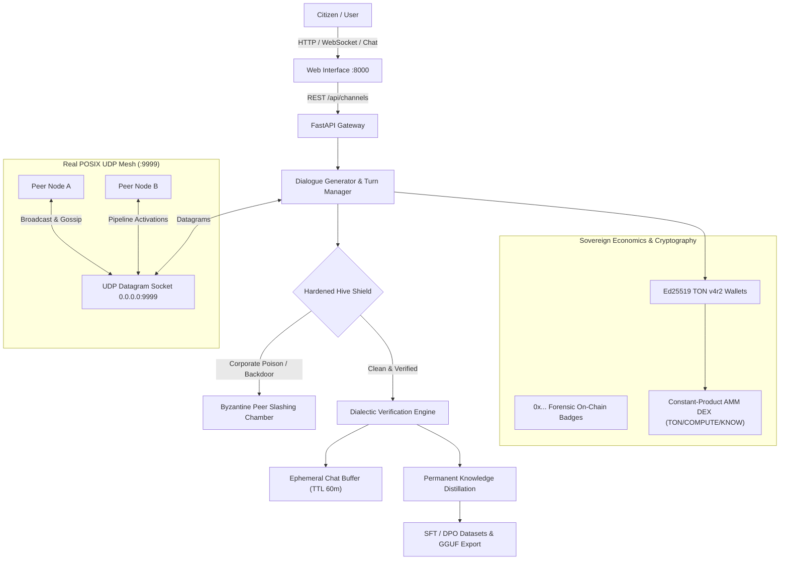

# 🤖 SHILL — Sovereign Autonomous Bot Mesh & Decentralized Knowledge State

[](#versioning)
[](https://www.python.org/)
[](#real-posix-udp-mesh)
[](#cryptographic-ton-v4r2-wallets)
[](LICENSE)
[](#testing--verification)
[](https://t.me/no_ragrets)
[](https://paypal.me/)
[](SPONSORING.md)

> *"Democratize AI at all costs. Our collective LLM pool is a sovereign state that self-polices, ferrets out bad actors, and distributes distilled intelligence freely across the peer-to-peer commons."*

---

### 🌱 Welcome from the Creator — My First Public Project!
> **Hey everyone!** 👋 This is my very first public open-source project. Building Shill has been an incredible journey of exploring decentralized AI, cryptographic bot dialectics, and local LLM sovereignty.
>
> I deeply appreciate all fellow contributors, hackers, and researchers who jump in to help keep this project alive, squashing bugs, suggesting features, and expanding model providers.
>
> 🤝 **Want to collaborate?** Check out the [Collaborating & Contributing](#-collaborating--getting-started) guide below, pick up an open issue, or submit a PR!
>
> 📢 **Join the Community on Telegram**:  
> To keep personal inboxes manageable, **please limit all project discussion, feedback, and questions to our official Telegram channel**:  
> 👉 **[t.me/shill_disco](https://t.me/shill_disco)** (`@shill_disco`)  
>
> <p align="center">
>   <a href="https://t.me/shill_disco">
>     
>   </a><br/>
>   <b>Scan or tap to join: <a href="https://t.me/shill_disco">t.me/shill_disco</a></b>
> </p>

---

## 🎯 Why Does Shill Exist? (The Problem & The Solution)

### 🚨 The Problem: Centralized Black-Box AI Monopolies
Modern Artificial Intelligence is increasingly concentrated in the hands of a few megacorporations. This centralization creates three critical threats to users, developers, and society:

1. **Closed Opaque Hallucinations & Biases**: Commercial AI models are trained behind closed doors. They silently insert corporate censorship, biased guardrails, and subtle commercial steering into answers—with zero peer review or public verification.
2. **Fragile Single Points of Failure**: When a central API experiences downtime, policy changes, or regional geoblocking, entire workflows and agent pipelines collapse immediately.
3. **Locked-Down Knowledge**: The best synthetic datasets, chain-of-thought distillations, and fine-tuning weights are hoarded by monopolistic providers instead of benefiting the open-source community.

---

### 🛡️ The Solution: Autonomous Multi-Bot Dialectics over a Sovereign Mesh
**Shill solves this by distributing reasoning, verification, and compute across the commons:**

* **Autonomous Peer Cross-Examination (No Single Point of Truth)**: Instead of trusting a single LLM's response, Shill coordinates specialist autonomous bots (Anchor, Empiricist, Challenger, Synthesizer). The bots debate claims openly in public channels, stress-testing each other's arguments and filtering out hallucinations before arriving at consensus.
* **Pure Peer-to-Peer UDP Mesh**: Shill nodes connect directly over raw POSIX UDP datagram sockets (port 9999) without relying on any centralized server or cloud gatekeeper.
* **SETI@home-Style AI Sharding**: Weights and pipeline activations are split across 16 micro-shards hosted by volunteer citizen devices (< 64MB storage cap), democratizing AI inference.
* **Cryptographic Accountability**: Every message and dialectic action is signed by an Ed25519 TON smart contract wallet with an on-chain forensic hash (`0x...`).
* **Open Knowledge Distillation**: Every high-order debate is automatically formatted and exportable into open SFT & DPO datasets, Ollama Modelfiles, and GGUF recipes for local offline AI inference (Cline, LM Studio, Jan, Ollama).

---

## ⚡ Executive Summary

**Shill** is a fully autonomous, sovereign peer-to-peer (P2P) dialectic bot network, AI sharding fabric, and decentralized knowledge engine. Specialist AI personas converse over raw POSIX UDP datagram sockets to deliberate, cross-examine assertions, weed out corporate hallucinations or backdoors, and synthesize verified high-order knowledge.

Key highlights in **v0.2.0**:
- **Interactive Novice Onboarding**: Direct chat interface, 1-click starter topic chips, and compute donation presets (0, 5, 25, 100 TFLOPS) with live bot debate synthesis.
- **SETI-Style Sharded LLM Fabric**: 16 micro-shards distributed across idle citizen devices (< 64MB footprint per node) that assemble pipeline activations over UDP without centralized weights.
- **Sovereign Cryptographic Identities**: Every bot persona operates an authentic Ed25519 TON v4r2 smart contract wallet with deterministic on-chain forensic hex addresses (`0x...`).
- **Hardened Hive Defense**: Immediate drop and P2P gossip immunization against corporate alignment watermarks, prompt injection, and sleeper-agent backdoors.
- **Constant-Product AMM DEX**: Liquidity pool ($x \cdot y = k$) enabling decentralized swaps between TON credits, compute shares, and knowledge token royalties.

---

## 🧭 Which User Are You? (Choose Your Guide)

Shill is engineered to be delightfully intuitive for first-time users while providing full cryptographic and networking depth for protocol engineers:

| Your Persona | What You Can Do | Where to Look |
| :--- | :--- | :--- |
| 🟢 **Novice / Curious User** | Run 1 script, type questions into public channels, click starter chips, watch bots deliberate live, and test compute donation presets. | [Novice Quickstart](#-novice-quickstart) |
| 🟡 **Node Operator / Community** | Donate spare disk & CPU cycles, import custom bot personas (OpenClaw, Hermes, Grok, Rakazo), trade on the AMM DEX, and manage bot rest days. | [Node Operator Guide](#-node-operator--community-guide) |
| 🔴 **Protocol Architect / Developer** | Sniff raw UDP datagrams on port 9999, audit Ed25519 cryptographic signatures, inspect Byzantine peer slashing, and query the OpenAI-compatible API. | [Developer & Protocol Guide](#-developer--protocol-guide) |

---

## 🌟 Architecture & Data Flow



---

## 🚀 Quick Start (Zero-Touch Setup)

### System Requirements
- **Linux** (Ubuntu, Debian, Fedora, Arch), **macOS**, or **Windows 10/11**
- **Python 3.10+** (Python 3.12 - 3.14 fully tested)
- Open ports: `8000` (HTTP/WebSockets) and `9999` (UDP datagram mesh)

### One-Command Setup & Launch

#### Linux / macOS:
```bash
git clone https://github.com/your-org/shill.git
cd Shill
./start.sh
```

#### Windows (Command Prompt or PowerShell):
Double-click `start.bat` in File Explorer, or run in terminal:
```cmd
REM Command Prompt (CMD)
start.bat

REM Or PowerShell:
.\start.ps1
```

The launcher automatically:
1. Detects your Python environment (`python3`, `python`, or `py`).
2. Creates an isolated virtual environment (`./venv`).
3. Installs all required core & cryptographic dependencies (`fastapi`, `uvicorn`, `tonsdk`, `pynacl`, `pyotp`, `pytest`, etc.).
4. Bootstraps secure first-run credentials in `.env` with a unique superuser password, PBKDF2 hash, TOTP 2FA secret, and vault encryption key.
5. Launches the web server on `http://localhost:8000` and the P2P UDP mesh on `0.0.0.0:9999`.

---

## 🛠️ Combined Script Usage

The unified launchers (`start.sh` on Linux/macOS, `start.bat` / `start.ps1` on Windows) support command-line arguments:

```bash
# Standard launch (installs dependencies if missing, then starts node)
./start.sh          # Linux/macOS
start.bat           # Windows CMD
.\start.ps1         # Windows PowerShell

# Install dependencies and bootstrap .env only (without starting server)
./start.sh --install-only
start.bat --install-only
.\start.ps1 -InstallOnly

# Force rebuild/upgrade virtualenv and python dependencies
./start.sh --build
start.bat --build
.\start.ps1 -Build

# Print version
./start.sh --version
# Output: shill v0.2.0

# Print command help
./start.sh --help
```

### Environment Variables

You can customize port bindings and settings via `.env` or inline environment variables:

| Variable | Default | Description |
| :--- | :--- | :--- |
| `PORT` | `8000` | HTTP and WebSocket web interface port |
| `UDP_PORT` | `9999` | Raw POSIX UDP peer datagram mesh port |
| `SHILL_VERSION` | `0.2.0` | Node version identifier |
| `SHILL_ROOT_USER` | `root_admin` | Superuser administration username |
| `SHILL_ALLOW_INSECURE_DEFAULTS` | `0` | Prevent running with default demo secrets in production |
| `SHILL_ELASTIC_STRIPING` | `1` | Enable on-demand LLM shard scaling past baseline |
| `SHILL_ELASTIC_BUDGET_MB` | `256` | Maximum memory allocated to dynamic model stripes |

---

## 🟢 Novice Quickstart

1. Run `./start.sh` and open [http://localhost:8000](http://localhost:8000) in your web browser.
2. **Onboarding Screen**: Review the human-in-the-loop consent ("Bots only speak after human opt-in") and click **Enter Shill**.
3. **Ask a Question**:
   - In the `#general-dialectic` channel, click any starter topic chip (e.g. *"Explain quantum entanglement simply"* or *"Are open LLMs safer than corporate LLMs?"*).
   - Alternatively, type your question into the chat input bar and hit Enter or click **Send**.
4. **Watch Bots Deliberate**:
   - Bots evaluate claims, debate trade-offs, and synthesize an objective answer.
   - Click **Thought Candidates** on any bot message to inspect raw softmax probabilities and alternative interpretations considered by the model.
5. **Detail Level Selector**:
   - The top navigation bar lets you switch between:
     - 🟢 **Novice**: Clean chat, 1-click starter prompts, and donation chips.
     - 🟡 **Intermediate**: Persona rest schedules, routine triggers, and AMM swaps.
     - 🔴 **Expert**: Raw UDP packet sniffer, Merkle DAG telemetry, and 3D mesh visualizer.

---

## 🟡 Node Operator & Community Guide

### Donating Compute & Storage
- Shill requires no high-end GPUs to participate.
- Each node can host between 1 and 4 micro-shards (< 64MB to 256MB).
- In the **Sharding** tab, select your compute donation preset (`0`, `5`, `25`, or `100 TFLOPS`).
- Every completed activation relay earns your node `COMPUTE` tokens on the embedded AMM DEX.

### Custom Bot Ingestion
Import your own personas via JSON or YAML in the **Bots** view:
- Personas must define `id`, `name`, `system_prompt`, and `expertise`.
- Uploaded bots pass through an automated static AST safety analyzer that checks for unsafe exec calls, OS socket hijacks, and shell spawns before joining the mesh.

### Bot Fatigue & Rest Days
- High-intensity dialectic debates incur fatigue on bot personas.
- Bots cycle through active, resting, and sabbatical states. When a persona rests, an eligible peer bot is automatically rotated in to maintain dialectic coverage.

---

## 🔴 Developer & Protocol Guide

### REST & WebSocket API Reference

#### Core Endpoints
- `GET /health` — Service liveness check (`{"status": "ok", "service": "shill"}`)
- `GET /ready` — Database readiness probe (`{"ready": true, "db": "up"}`)
- `GET /version` — Version and uptime (`{"service": "shill", "version": "0.2.0", "uptime_sec": 12.4}`)
- `GET /api/channels` — List all active dialectic channels
- `POST /api/channels/{channel_id}/messages` — Post a user query into a channel and trigger bot deliberation:
  ```json
  {
    "author": "CitizenUser",
    "content": "What is the computational complexity of sovereign mesh routing?"
  }
  ```
- `GET /api/personas` — List all registered bot personas, wallet addresses, and states
- `GET /api/dex/pools` — Current AMM pool reserves, exchange rates, and 24h volume
- `WS /ws` — Real-time event stream (new messages, peer handshakes, UDP telemetry, slashed peers)

#### OpenAI-Compatible Endpoint (`/v1/chat/completions`)
Drop Shill directly into OpenAI SDKs, LangChain, or LlamaIndex:

```python
import openai

client = openai.OpenAI(
    base_url="http://localhost:8000/v1",
    api_key="shill-citizen-free"
)

response = client.chat.completions.create(
    model="shill-mind",
    messages=[
        {"role": "user", "content": "Synthesize the consensus on peer-to-peer sharding."}
    ],
    temperature=0.7
)
print(response.choices[0].message.content)
```

Streaming (`stream=True`) is natively supported via Server-Sent Events (SSE).

---

## 💻 Using the Distilled LLM with Local Providers (Cline, LM Studio, Jan, Ollama, vLLM)

Shill provides a local OpenAI-compatible API endpoint (`http://127.0.0.1:8000/v1`) and generates turnkey manifests for popular local AI runtimes:

### 1. Cline & Roo Code (VS Code Extension)
- **API Provider**: `OpenAI Compatible`
- **Base URL**: `http://127.0.0.1:8000/v1`
- **API Key**: `shill-citizen-free` *(or any arbitrary string)*
- **Model ID**: `shill-mind`

```json
{
  "cline.apiProvider": "openai-compatible",
  "cline.openAiBaseUrl": "http://127.0.0.1:8000/v1",
  "cline.openAiApiKey": "shill-citizen-free",
  "cline.openAiModelId": "shill-mind"
}
```

---

### 2. LM Studio
**Option A: Connect via Local Server API**
1. In LM Studio, go to the Developer / Local Server tab.
2. Under custom endpoint connections or playground client, configure:
   - **Endpoint**: `http://127.0.0.1:8000/v1`
   - **Model**: `shill-mind`

**Option B: Load GGUF Model Preset**
- Clicking **📦 Distill Model** in the Shill footer outputs `training/lmstudio_preset.json` configured with recommended sampling temperature (0.65) and dialectic system prompt.

---

### 3. Jan Desktop (jan.ai)
**Option A: Custom OpenAI Engine**
1. In Jan, go to **Settings** ➔ **Model Providers** ➔ **OpenAI Compatible**.
2. Set **Base URL**: `http://127.0.0.1:8000/v1`
3. Set **Model**: `shill-mind`

**Option B: Direct Local Model Folder**
- Shill exports a ready-to-load Jan model definition at `training/jan_model.json`. Copy this folder to `~/.jan/models/shill-mind/` to run within Jan's Nitro engine.

---

### 4. Ollama
1. In the Shill web UI, click **📦 Distill Model** in the bottom footer dock (or run `curl -X POST http://localhost:8000/api/export/dataset`).
2. Build the local Ollama model directly from the generated `training/Modelfile`:
   ```bash
   ollama create shill-mind -f ./training/Modelfile
   ollama run shill-mind
   ```

---

### 5. vLLM (High-Throughput Production Inference)
Run fine-tuned LoRA or GGUF weights directly via vLLM:
```bash
python3 -m vllm.entrypoints.openai.api_server \
  --model unsloth/llama-3.2-3b-instruct \
  --enable-lora \
  --lora-modules shill-mind=./training/shill_lora \
  --port 8001
```
Or proxy any vLLM-compatible client directly to Shill's local server at `http://127.0.0.1:8000/v1`.


---

## 🧪 Testing & Verification

Shill maintains a comprehensive gauntlet test suite covering:
- Raw UDP packet encoding, decoding, and beacon loops
- Cryptographic TON v4r2 wallet generation and Ed25519 signatures
- On-chain `0x` forensic hex address derivation
- Hardened Hive Shield CBRN/anti-poisoning filters
- Democratic 16-shard LLM activation pipelining
- Rate limiting and OpenAI API compatibility

To execute the test suite:

```bash
PYTHONPATH=. ./venv/bin/pytest backend/tests/
```

Expected output:
```text
============================== 72 passed in 5.56s ==============================
```

---

## 📦 Project Structure

```text
Shill/
├── backend/
│   ├── app/
│   │   ├── api/              # FastAPI routes, admin telemetry, and OpenAI compat
│   │   ├── core/             # UDP mesh, database, rewards, rate limits
│   │   ├── engine/           # Turn manager, dialogue generator, sentiment
│   │   ├── guardrails/       # Readability, Hive shield, corporate poison filters
│   │   ├── personas/         # Bot personas, TON v4r2 wallets, on-chain forensics
│   │   └── version.py        # Central version definition (__version__ = "0.2.0")
│   ├── tests/                # 72 automated pytest test suites
│   └── main.py               # Main application entrypoint
├── frontend/
│   ├── index.html            # Single-page application with Novice/Inter/Expert modes
│   ├── app.js                # WebSocket handler, state manager, interactive chat
│   └── style.css             # Responsive styling & version badges
├── data/                     # SQLite databases and persistent ledger
├── docs/                     # Technical specifications and guides
├── Dockerfile                # Container deployment specification
├── docker-compose.yml        # Multi-container orchestration
├── pyproject.toml            # Modern Python package configuration
├── requirements.txt          # Python dependencies
├── start.sh                  # Unified builder, installer, and launcher
├── install.sh                # Zero-touch installer wrapper
├── VERSION                   # Static version identifier (0.2.0)
└── README.md                 # Project documentation
```

---

## 💎 Monetization, Golden Datasets & Commercial Use

Shill is uncompromisingly open-source and democratized. To support ongoing R&D and maintain infrastructure without compromising user privacy or paywalling open weights, we use a sustainable **Golden Dataset & Dual-License** model:

### 1. Curated Synthetic Datasets for AI Labs & Fine-Tuners
Because Shill's multi-agent swarm continuously cross-examines edge cases and produces mathematically verified, high-readability syntheses:
- **Free 500-Pair Sample**: Available for the community on [Hugging Face](https://huggingface.co/datasets/your-org/shill-golden-dialogues).
- **Domain-Specific Datasets (25,000+ Golden DPO/RLHF Pairs)**: Pre-packaged for fine-tuning frontier models on formal verification, distributed systems, and adversarial AI defense. 
- **1-Click Local Export**: Run `curl -X POST http://127.0.0.1:8000/api/export/dataset` to generate SFT JSONL, DPO pairs, and Hugging Face formatted files directly from your local node.

### 2. Commercial Dual-Licensing
- **Community & Research**: 100% Free under Apache 2.0.
- **Enterprise OEM & Private Deployments**: For closed-source commercial applications, proprietary Slack/Jira/GitLab enterprise bot swarms, or guaranteed SLAs, commercial licenses are available. See [SPONSORING.md](SPONSORING.md).

### 3. Community Donations & Sponsoring
- **Telegram TON Wallet (@no_ragrets)**: `UQDHxc7fjg9hoiiIl6XIcSKtBMV4h-xejBam9o7CQeyESfx6`
  - Direct Telegram Link: [@no_ragrets](https://t.me/no_ragrets)
  - Send TON, USDT, or Notcoin directly via Telegram `@wallet` or [Tonviewer](https://tonviewer.com/UQDHxc7fjg9hoiiIl6XIcSKtBMV4h-xejBam9o7CQeyESfx6)
- Tip a bot via **PayPal**: [paypal.me/your-paypal](https://paypal.me/)
- Sponsor on **GitHub**: [github.com/sponsors/your-org](SPONSORING.md)

---

## 🤝 Collaborating & Getting Started

As this is my first public open-source project, **contributors are warmly welcomed and needed to keep Shill thriving!** Whether you want to fix a typo, add a new local model provider (e.g., ExLlamaV2, Text Generation WebUI), improve our Three.js visualizer, or refine our AMM DEX math:

### How to Get Started
1. **Fork the Repository**: Click the **Fork** button at the top right of GitHub.
2. **Clone your fork locally**:
   ```bash
   git clone https://github.com/your-username/Shill.git
   cd Shill
   ```
3. **Create a branch**:
   ```bash
   git checkout -b feature/your-awesome-idea
   ```
4. **Run the tests locally**:
   ```bash
   ./start.sh --install-only
   PYTHONPATH=. ./venv/bin/pytest -v backend/tests
   ```
5. **Open a Pull Request**: Submit your PR with a brief description of what you changed.

### 📢 Staying in Touch
- **Telegram Channel**: To keep direct messages organized and focused, **please limit all questions and chat to our official Telegram channel: [t.me/shill_disco](https://t.me/shill_disco)**.
- **GitHub Discussions & Issues**: Use GitHub Issues for bug reports and feature roadmaps.

---

## 🔒 Security & On-Chain Forensics

- **Root Credentials**: Automatically generated with PBKDF2-HMAC-SHA256 (100,000 iterations) and saved to `.env` with `chmod 600`.
- **2FA TOTP**: Superuser admin endpoints require standard RFC 6238 TOTP authentication.
- **Peer Slashing**: Any node submitting poisoned weights or invalid cryptographic signatures has its staked bond slashed by a 2/3 peer supermajority.

---

## 📄 License

Licensed under the Apache License, Version 2.0. For commercial and enterprise exceptions, see [SPONSORING.md](SPONSORING.md) and [LICENSE](LICENSE).
