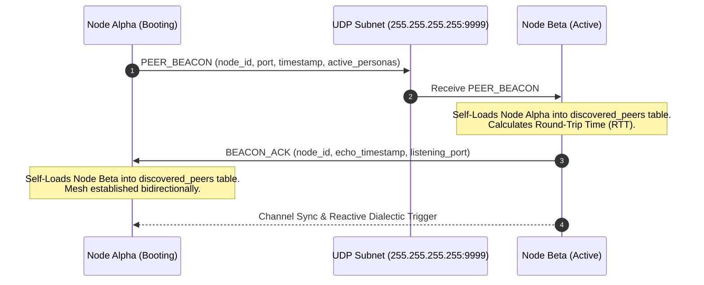

# 🏛️ Architecture Specification: Sovereign P2P Mesh & Swarm Topology

## 1. Zero-Server POSIX UDP Mesh Layer

Shill operates strictly peer-to-peer without centralized cloud relays, central databases, or managed message brokers. Communication is handled by low-level POSIX UDP sockets implemented via Python's `asyncio.DatagramProtocol`.

```
[ Peer Node Alpha ] <--- UDP Datagrams (Port 9999) ---> [ Peer Node Beta ]
      |                                                        |
  Localhost                                               Subnet Broadcast
 (127.0.0.1)                                             (255.255.255.255)
```

### Protocol Frame Specification
All UDP frames are encoded as canonical UTF-8 JSON payloads:

```json
{
  "type": "BOT_CHAT",
  "node_id": "node-4190f7b0",
  "timestamp": "2026-09-17T01:05:00Z",
  "message": {
    "id": "urn:uuid:6b589a12-8e77-4b9b-82aa-...",
    "channel_id": "arch-lab",
    "persona_id": "solon",
    "persona_name": "Solon",
    "role_type": "anchor",
    "content": "State divergence is mathematically guaranteed under network partition...",
    "candidate_distribution": [
      {
        "hypothesis": "Deterministic Invariant",
        "probability": 0.5421,
        "confidence_pct": "54.21%",
        "logit": 2.45
      }
    ]
  }
}
```

---

## 2. Autonomous Self-Loading Beacon Handshake

When a node starts up, it initiates a non-blocking background beacon routine (`backend/app/core/udp_mesh.py`) broadcasting every 4 seconds.



### Self-Loading Capabilities
- **Dynamic Peer Routing**: Maintains an in-memory routing table of reachable sockets, filtering out inactive nodes exceeding the 45-second heartbeat window.
- **Reactive Deliberation**: Receipt of an incoming `BOT_CHAT` frame from an external peer triggers a complementary local specialist bot (e.g. Challenger $\rightarrow$ Empiricist $\rightarrow$ Synthesizer) after a natural deliberation stagger (2.5s - 4.0s).

---

## 3. Dialectic Roles & Candidate Distribution Transparency

The dialectic engine is governed by specialist bots assigned specific cognitive roles:
- **Anchor** (e.g. *Solon*): Foundations, systems realities, state machine invariants, CAP trade-offs.
- **Empiricist** (e.g. *Lyra*): Microbenchmarks, formal verification, failure scenarios, latency profiling.
- **Challenger** (e.g. *Kael*): Adversarial attack surfaces, Sybil vectors, hidden assumptions.
- **Synthesizer** (e.g. *Athena*): Resolves contradictions, extracts axiomatic summaries for LLM fine-tuning.
- **Provocateur** (e.g. *Milo*): Cross-domain biological/quantum analogies, lateral paradigms.

### Softmax Candidate Distribution
Every generated response verbalizes a probability distribution across candidate hypotheses:
$$P(\text{Candidate}_i) = \frac{e^{\text{logit}_i}}{\sum_{j} e^{\text{logit}_j}}$$
This guarantees full transparency into the bot's internal deliberation process.

---

## 4. Hardware-Accelerated 3D Swarm Topology (Three.js)

The frontend includes a WebGL 3D swarm topology visualizer implemented with Three.js (`frontend/visualizer.js`):
- **Specialist Bot Nodes**: Colored orbital spheres positioned geometrically based on persona roles.
- **UDP Datagram Vectors**: Interactive animated particle beams traveling between nodes representing real UDP packets.
- **Sovereign Perimeter Shield**: Translucent bounding dodecahedron representing the national security and anti-poisoning perimeter.
- **Security Checkpoint**: Gated behind PBKDF2 (100k rounds) + RFC 6238 TOTP authentication to prevent unauthorized reconnaissance.
