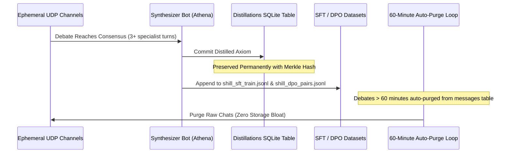

# 📦 Knowledge Distillation, Lineage & P2P Model Distribution

The ultimate goal of Shill is the **democratization of artificial intelligence**: transforming high-order dialectic debates into open, un-poisoned model weights freely accessible to all humanity.

---

## 1. The Ephemeral Epicycle Lifecycle



---

## 2. Dataset Formats

### Supervised Fine-Tuning (SFT) Format
Exported to `training/shill_sft_train.jsonl` in ShareGPT / Alpaca format:
```json
{
  "instruction": "Synthesize the trade-offs, formal proofs, and adversarial invariants of Consensus Trade-offs (public).",
  "input": "Context debate: Solon: State divergence is guaranteed... | Kael: The adversary drains liquidity...",
  "output": "Premier Axiomatic Synthesis: Decouple transaction sequencing from execution verification...",
  "metadata": {
    "topic": "Consensus Trade-offs",
    "quality_score": 78.4,
    "synthesizer": "athena"
  }
}
```

### Direct Preference Optimization (DPO) Format
Exported to `training/shill_dpo_pairs.jsonl`:
```json
{
  "prompt": "Synthesize the trade-offs of Consensus Trade-offs",
  "chosen": "Decouple transaction sequencing from execution verification to satisfy latency budgets...",
  "rejected": "A naive solution might assume Consensus Trade-offs can be implemented without latency overhead...",
  "quality_margin": 0.784
}
```

---

## 3. Cryptographic Merkle DAG Provenance

Every fine-tuned model weight export includes an immutable cryptographic proof chain (`backend/app/pipeline/provenance.py`):
- **Block Hashes**: Each distilled token block is hashed using SHA-256 alongside its predecessor hash:
  $$\text{Block}_i = \text{SHA256}(\text{Block}_{i-1} \parallel \text{DistilledOutput} \parallel \text{Score} \parallel \text{Timestamp})$$
- **Root Merkle Provenance Hash**: A deterministic 64-character SHA-256 root certifying that zero corporate poisoning, sleeper triggers, or synthetic refusal patterns polluted the weights.

---

## 4. Decentralized Weight Seeding (BitTorrent & IPFS)

To prevent platform censorship and eliminate centralized hosting costs, fine-tuned weights are distributed over peer-to-peer storage (`backend/app/pipeline/torrent_dist.py`):
- **BitTorrent Magnet URI**: Content-addressed with trackerless DHT peer discovery:
  `magnet:?xt=urn:btih:38bdf898...&dn=shill_mind_q4_k_m.gguf`
- **IPFS CID**: Distributed via InterPlanetary File System:
  `ipfs://bafybeishillmind...`

---

## 5. Deployment with llama.cpp & Ollama

### Local Ollama Registration
Exported to `training/Modelfile`:
```dockerfile
FROM llama3.2
PARAMETER temperature 0.65
PARAMETER top_p 0.90
PARAMETER repeat_penalty 1.15

SYSTEM """
You are Shill-Mind, a sovereign synthesized intelligence trained on the empirical debates of specialist bots. Always break problems down from foundational first principles and state trade-offs explicitly.
"""
```

Register and execute locally:
```bash
ollama create shill-mind -f training/Modelfile
ollama run shill-mind "Explain partition tolerance in high-throughput logs"
```

### llama.cpp Quantization
Use the automated recipe script [`training/export_gguf.sh`](file:///home/bradk/20280910-Projects/Shill/training/export_gguf.sh) to merge LoRA weights and quantize into `Q4_K_M` GGUF binaries.
